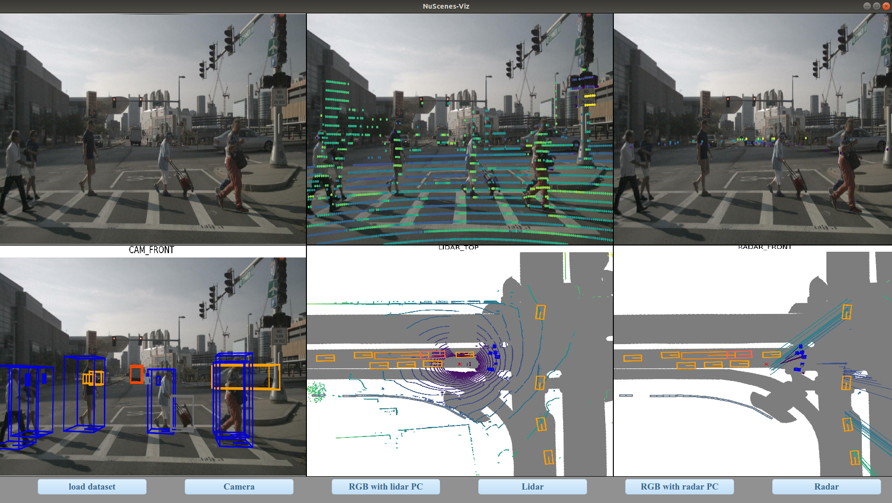

# NuScenes_Viz

This project aims to develop a tool to visualize datasets like [nuScenes](https://www.nuscenes.org/nuscenes). It consists of six windows:
* raw image
* raw image with lidar point cloud
* raw image with radar point cloud
* raw image with annos
* lidar point cloud with annos
* radar point cloud with annos



## Quick Start

1. [Download](https://www.nuscenes.org/download) the dataset or prepare our own dataset like nuscenes.

2. Establish environment.
```python
pip install -r requirements.txt
```

3. execute this tool.
```python
python nuscenes_viz.py
```
## References

* https://github.com/nutonomy/nuscenes-devkit

## Citation

Please use the following citation when referencing:
```
@{NuScenes Visualization Tool project,
author = {chen peng},
title = {nuscenes_viz},
website = {https://github.com/chiyukunpeng/nuscenes_viz},
month = {June},
year = {2021}
}
```
